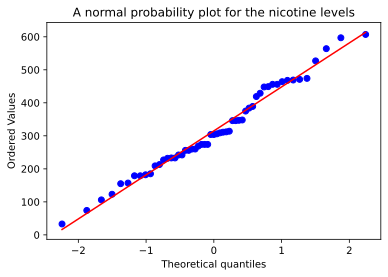

# Normal Probability Plots


```python
from scipy import stats
import pandas as pd
import matplotlib.pyplot as plt
```

## About

> In Section 5 of Unit 6, you have seen how to construct a probability plot to check whether a normal distribution is a plausible model for the variation in a dataset.

## Computer activity 9 

> Data on the blood plasma nicotine levels of 55 smokers are contained in the worksheet plasma.mwx. Obtain a normal probability plot for these data.
> Is a normal distribution a plausible model for the variation in blood plasma nicotine levels?

```python
# import the dataset
data = pd.read_csv("plasma.csv")
```

We will use `scipy.stats.probplot` to produce the Normal probability plot.
(See [documentation](https://docs.scipy.org/doc/scipy/reference/generated/scipy.stats.probplot.html)).

The method returns a tuple of arrays.
The data used to produce the plot is the 0th element of the tuple.
For example, using `res`, the data is stored in `res[0]`.

```python
fig = plt.figure()
ax = fig.add_subplot()
res = stats.probplot(data["Level"], plot=ax)
ax.set_title("A normal probability plot for the nicotine levels")
plt.show()
```



The points lie roughly along a straight line, suggesting that a normal model is plausible for the blood plasma nicotine levels of smokers.

## Caveats

- The $x$ and $y$ axis are flipped, compared to how they are presented in **M248**;
- There appears to be a different means of producing the regression line;
- The only reason we use `Pandas` is to parse the data
    - The data is stored in a `csv` file;
    - The data would need further processing if we imported using `Python.csv`.

These caveats are tolerable, given that the method:

- has the same utility;
- removes a need to produce and maintain a bespoke `function`.
