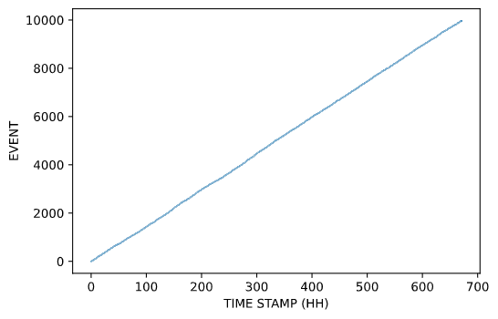
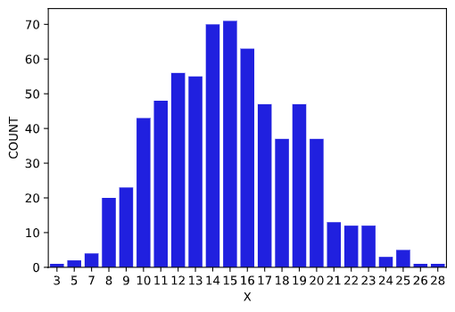
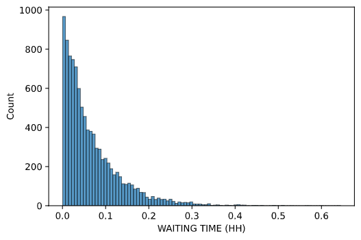

Outline

1. Scenario
2. Describing the data
3. Confirming the Poisson process
   1. Number of emails per hour
   2. Waiting time between emails
4. Estimating the rate, $\lambda$
   1. Point estimate
   2. Interval estimate
5. Using the model

-----

## 1. Scenario

## 2. Setting up the data

## 3. Does the data fit the Poisson process

### 3.1 Rate of occurrence remains constant over time

Data can be modelled by the **Poisson process** if it meets the following criteria:[^1]

1. Events occur singly;
2. The rate of occurrence of events remains constant;
3. The incidence of future events is independent of the past.

Let us assume that the data meets the first criteria. The second and third criteria can be checked by a single graph: *Is the average rate of emails received constant over the time period*?[^2]

The data[^3] was processed by introducing a new attribute: `TIME STAMP`.
This is the time, in hours that has passed from the start of the survey, that an email arrives.

**Figure 1**. Rate of emails over time

The $x-$axis shows the time, in hours, that has passed; the $y-$axis shows the event number.

We can see that the points lie approximately along a straight line, indicating that the rate of events remained constant over time.
This suggests that the Poisson process is indeed a suitable model for the scenario.

### 3.2 Frequency of the distinct number of events

Another property that we must confirm is that the **number of emails received per hour** is approximately a Poisson distribution.[^1][^2]
We can confirm this by comparing the frequency of each distinct number of emails per hour, $x_{i}$, with that of the Poisson probability mass function of $\text{Poisson}(\lambda)$, where $\lambda$ is the mean of the frequency of each distinct number of emails per hour.

The data[^4] was again processed by first aggregating the number of emails received per hour per day.
We then produced a series with range $x_i = 0, 1, 2, \ldots, x_{\text{max}}$, and counted the number of time each $x_{i}$ occurred in the aggregated data.

**Figure 2**. Frequency of each distinct number of emails per hour.

The plot in **Figure 2** is unimodal, with a single peak at $X=15$, and is approximately symmetrical.
This indicates that the distribution could be modelled by a **Poisson distribution**, with a parameter $\lambda \simeq 15$.

The Poisson distribution has the property that its mean is equal to its variance.
Does the sample mean number of emails of the sample provided equal its variance? The approximate mean of the number of emails per hour is $14.9$, and the variance is $15.1$.
These two figures are close enough that we can say they are approximately equal, so we can conclude that the distribution of the *number of emails per hour* is indeed approximately Poisson.

### 3.3 Waiting times between emails

The final property of the Poisson process that we must confirm is that the **waiting times between emails** is approximately an exponential distribution.[^1][^2]

The data[^5] was processed so we could identify the time (in hours) between each event.
The data produced is visualised in **Figure 3**.

**Figure 3**. Waiting time between sucessive emails.

The histogram is highly right-skewed, with a peak of low values, as is expected by an exponential distribution.

This can be further supported by checked if the mean waiting time is approximately equal to the standard deviation.
The approximate sample mean waiting time is $0.0673$, with standard deviation $0.0671$.
These two figures are close enough that we can say they are approximately equal, so we can conclude that the distribution of the *waiting time between emails* is indeed approximately exponential.

## 4. Estimating the rate of emails of hours $\widehat \lambda$

### 4.1 Number of emails per hour

We confirmed in **(3.2)** that it was possible the number of emails per hours could be modelled by the **Poisson distribution**, with parameter $\lambda$ being the expected number of emails per hour.

The maximum likelihood estimator of the Poisson distribution is given by $\widehat \theta_{f} = \overline X$, where $\overline X$ is the average number of emails per hour.[^6]
We calculated $\overline X \simeq 14.9$ in **(3.2)**, so we propose that the number of emails per hour, $X$, can be modelled by a Poisson distribution, $\text{Poisson}(\widehat \theta_{f})$, where $\widehat \theta_{f} = \overline X = 14.9$.

### 4.2 Waiting time between emails

We confirmed in **(3.3)** that it was possible the waiting time between emails in unit hours could be modelled by the **exponential distribution**, with parameter $\lambda$ being the expected number of emails per hour.

The maximum likelihood estimator of the exponential distribution is given by $\widehat \theta_{w} = 1 / \overline T$, where $\overline T$ is the awaiting time between emails in unit hours.[^6]
We calculated $\overline T \simeq 0.0673$ in **(3.3)**, so we propose that the waiting time between emails in unit hours, $T$, can be modelled by an exponential distribution distribution, $M(\widehat \theta_{w})$, where $\widehat \theta_{w} = \overline T \simeq 14.9$.

### 4.3 Estimating $\widehat \lambda$ with 95% confidence

We can produce a more useful estimate by calculating the 95% confidence interval for $\widehat \lambda$.[^7]
An approximate large-sample $100(1 − \alpha)\%$ confidence interval for the Poisson parameter $\lambda$ is
$$
(\lambda^{-}, \lambda^{+}) = \bigg(\overline x - z \sqrt{\frac{\overline x}{n}}, \overline x + z \sqrt{\frac{\overline x}{n}}\bigg)
$$

where $\overline x$ is the **sample mean**, and $z$ is the $(1 − (\alpha/2))-$quantile of the standard normal distribution.
This was calculated[^8], resulting in an approximate 95% confidence interval of $(14.78, 14.93)$.

## 5 Conclusion

In this report, we took a large dataset containing approximately 10,000 observations of the date and time of the receipt of an email by a company.
The company was interested in modelling the number of emails they received per hour, and the waiting time between successive emails.
It was confirmed that the sample could be modelled by a **Poisson process**. This confirmation was used to calculate the maximum likelihood estimators of the Poisson and exponential parameters to ascertain $\widehat \theta$.
We also calculated the 95% confidence interval for estimate.

[^1]: M248 Book A5.3.
[^2]: M248 Computer book A10.1
[^3]: Link to notebook and rate_csv
[^4]: Link to notebook and freq_per_hour.csv
[^5]: Link to notebook and waiting_time.csv
[^6]: M248 Book B.7.4
[^7]: M248 Book B8.3
[^8]: Link to notebook
