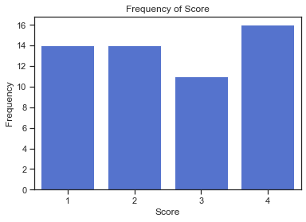

# Bar charts of Raw Data

Date: 2020-01-26

#countplot #set

## About

The data is `tattoos.csv` is not yet summarised (it is a *raw data*), so we need to aggregate it.
We do this using `sns.countplot()`.

## Python

```python
import pandas as pd
import seaborn as sns
import matplotlib.pyplot as plt
```

```python
# import the csv
tattoos = pd.read_csv("./data/tattoos.csv")
```

```python
# plot Score
f, ax = plt.subplots()
ax = sns.countplot(data=tattoos,
                   x="Score",
                   color="royalblue")
# set y-axis and title
ax.set(ylabel="Frequency",
       title="Frequency of Score")
# display the plot
plt.show()
```



## References

- Activity 4 (Computer Book A)
- Bar charts (Unit 1.3.1)
- M248 Handbook pp.5
- [Link to notebook]()
