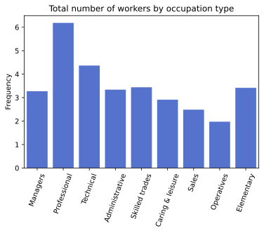

# Bar charts of Summarised Data

Date: 2020-01-26

#barplot #set #xticks

## About

The data is `workforce.csv` is already summarised, in that the data in `Total` is already an aggregate figure.
This means we can visualise the data using `sns.barplot()`.

## Python

```python
import pandas as pd
import seaborn as sns
import matplotlib.pyplot as plt
```

```python
# import the csv
workforce = pd.read_csv("./data/workforce.csv")
# preview data
workforce.head()
```

<div>
<style scoped>
    .dataframe tbody tr th:only-of-type {
        vertical-align: middle;
    }

    .dataframe tbody tr th {
        vertical-align: top;
    }

    .dataframe thead th {
        text-align: right;
    }
</style>
<table border="1" class="dataframe">
  <thead>
    <tr style="text-align: right;">
      <th></th>
      <th>Occupation type</th>
      <th>Male</th>
      <th>Female</th>
      <th>Total</th>
    </tr>
  </thead>
  <tbody>
    <tr>
      <th>0</th>
      <td>Managers</td>
      <td>2.118</td>
      <td>1.153</td>
      <td>3.271</td>
    </tr>
    <tr>
      <th>1</th>
      <td>Professional</td>
      <td>3.172</td>
      <td>3.014</td>
      <td>6.186</td>
    </tr>
    <tr>
      <th>2</th>
      <td>Technical</td>
      <td>2.466</td>
      <td>1.901</td>
      <td>4.367</td>
    </tr>
    <tr>
      <th>3</th>
      <td>Administrative</td>
      <td>0.860</td>
      <td>2.480</td>
      <td>3.340</td>
    </tr>
    <tr>
      <th>4</th>
      <td>Skilled trades</td>
      <td>3.107</td>
      <td>0.334</td>
      <td>3.441</td>
    </tr>
  </tbody>
</table>
</div>

```python
# plot Occupation type by Total
f, ax = plt.subplots()
sns.barplot(data=tattoos,
            x="Occupation type",
            y="Total",
            color="royalblue")
# set y-axis and title
ax.set(xlabel="",  # suppress the x label
       ylabel="Frequency",
       title="Total number of workers by occupation type")
plt.xticks(rotation=70)  # rotate the x axis labels
plt.show()  # display the plot
```



## References

- Activity 5, (Computer Book A) ([Jupyter nb](https://github.com/ljk233/AutomatingM248/blob/master/comp_book/A-01-05_bar_charts.ipynb))
- Bar charts (Unit 1.3.1)
- M248 HB pp.5
- [seaborn.barplot()](https://seaborn.pydata.org/generated/seaborn.barplot.html#seaborn.barplot) (Seaborn)
