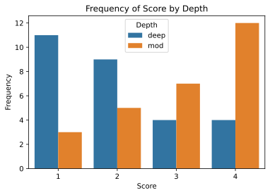

# Side-by-side Bar Charts

Date: 2020-01-26

#barplot #set

## About

Side-by-side bar char charts help us to compare similar data for different categorical variables.

Take the `tattoos.csv` data: Let us display the results on the quality of tattoo removal separately for deep tattoos and for tattoos of moderate depth, so we can compare the success of the surgical procedure for tattoos of different depths.

We will again use `countplot()` for this visualisation.
However we will also define the `hue=` parameter.

```python
import pandas as pd
import seaborn as sns
import matplotlib.pyplot as plt
```

```python
# import the csv
tattoos = pd.read_csv("./data/tattoos.csv")
# preview data
tattoos.head()
```

<div>
<style scoped>
    .dataframe tbody tr th:only-of-type {
        vertical-align: middle;
    }

    .dataframe tbody tr th {
        vertical-align: top;
    }
    
    .dataframe thead th {
        text-align: right;
    }
</style>
<table border="1" class="dataframe">
  <thead>
    <tr style="text-align: right;">
      <th></th>
      <th>Method</th>
      <th>Gender</th>
      <th>Size</th>
      <th>Depth</th>
      <th>Score</th>
    </tr>
  </thead>
  <tbody>
    <tr>
      <th>0</th>
      <td>A</td>
      <td>m</td>
      <td>large</td>
      <td>deep</td>
      <td>1</td>
    </tr>
    <tr>
      <th>1</th>
      <td>A</td>
      <td>m</td>
      <td>large</td>
      <td>mod</td>
      <td>1</td>
    </tr>
    <tr>
      <th>2</th>
      <td>B</td>
      <td>f</td>
      <td>small</td>
      <td>deep</td>
      <td>1</td>
    </tr>
    <tr>
      <th>3</th>
      <td>B</td>
      <td>m</td>
      <td>small</td>
      <td>mod</td>
      <td>4</td>
    </tr>
    <tr>
      <th>4</th>
      <td>B</td>
      <td>f</td>
      <td>large</td>
      <td>deep</td>
      <td>3</td>
    </tr>
  </tbody>
</table>
</div>

```python
# plot Score
f, ax = plt.subplots()
ax = sns.countplot(data=tattoos,
                   x="Score",
                   hue="Depth")
# set y-axis and title
ax.set(ylabel="Frequency",
       title="Frequency of Score by Depth")
# display the plot
plt.show()
```



We can see, by splitting out the data into further categories, that there seems to be a further pattern within the data.
People with deep tattoos generally give a lower score that people with moderate depth tattoos.

## References

- Activity 16, (Computer Book A) ([Jupyter nb](https://github.com/ljk233/AutomatingM248/blob/master/comp_book/A-04-16_SideBySideBarCharts.ipynb))
- Side-by-side bar charts (Unit 1.5.1)
- M248 HB pp.5
- [seaborn.barplot()](https://seaborn.pydata.org/generated/seaborn.barplot.html#seaborn.barplot) (Seaborn)
