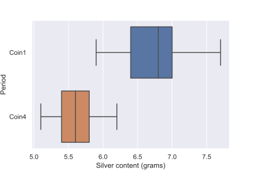
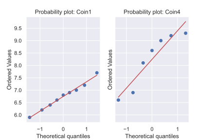

# Debasement of silver coins during the late Byzantine Empire

## Summary

## Introduction

The aim of this to report is to compare the mean silver content of two samples of silver coins minted by the Byzantine empire in the twelfth-century, during the reign of Manuel I Comnensus.
The data contains two samples of the silver content of coins minted during different periods of his rulership.
The exact periods of the minting are unknown, and the unit of measurement is not given.
This does not affect the analysis, but comparisons with other similar data suggests the units are in grams.
The data was taken from the Open University course **M248: Analysing data.**
No reference to the source data was given.

## Method

## Results

The distribution of the silver content of the coins is shown below.
The plot shows that the distribution of the coins from the earlier period (`Coin1`) generally had a higher silver content compared to coins from the later period (`Coin4`).

The data were approximately normally distributed, as confirmed by the two probability plots shown below.

Both distributions approximately follow a straight line, which is consistent with normally distributed data.
The coins from the later period have a greater degree of spread in the points, but they still follow the line close enough to assume normality.

We checked the assumption that there was a common population variance between the two samples calculating if the ratio of the two sample's standard deviations was less that 3.
The ratio was calculated as approximately 2.2, which is less than 3, so the assumption was justified.

The mean silver content in coins from the earlier period was approximately 6.7g, with 95% $t$-interval (6.3, 7.2).
Similarly, the mean silver content in coins from the later period was approximately 5.6g with 95% $t$-interval (5.3, 5.9).
A two-sample, one-sided $t$-test of the hypothesis of equal means gave $t=$ 4.73 on 14 degrees of freedom, with $p$-value of 0.0003.

## Discussion

With $p<$ 0.01, there is strong evidence against the null hypothesis that the mean silver content in both period's coins are equal.
The data indicates that the coins from the later period had a lower mean silver content compared to coins from the earlier period.
