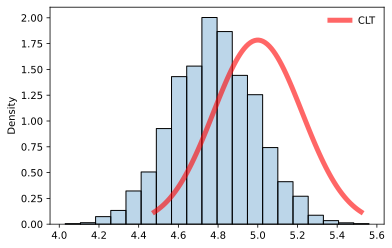
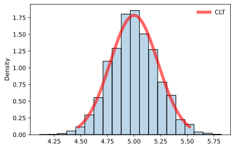

## About

This is quick follow-up note, showing the output of the bootstrap and CLT methods using the $\text{Poisson}(5)$ distribution.

I have made some alterations to the `clt()` and `bootstrap()` function:

- They now use use `seaborn` as well as `matplotlib.pyplot`
  - The API is simpler

- They now use the parameter `stat=density`, so output a relative frequency histogram
- The `bootstrap()` function now plots the CLT approximation, than the normal pdf
  - This makes a comparison easier
- A parameter `plot_normal` as been added to both functions
  - Accepts a `Boolean` value
  - Defaults to `False` (hide CLT approximation)

One small observation is that the mode of the histogram from `bootstrap()` is slightly off compared to what it should be ($\mu=5$).
The histogram from `clt()` is again centred at the expected value.

## Main

```python
from util.bootstrap import bootstrap
from util.clt import clt
from scipy.stats import poisson
from datetime import datetime
```

### Bootstrap

```python
start_time = datetime.now()  # start time
bootstrap(a_dist=poisson(mu=5), n=100, bins=20, plot_normal=True)
end_time = datetime.now()  # end time
```



```python
print('Duration: {}'.format(end_time - start_time))  # time to run
```

```
Duration: 0:00:43.312159
```

### CLT

```python
start_time = datetime.now()  # start time
clt(a_dist=poisson(mu=5), n=100, N=10000, bins=20, plot_normal=True)
end_time = datetime.now()  # end time
```



```python
print('Duration: {}'.format(end_time - start_time))  # time to run
```

```
Duration: 0:00:00.736165
```
