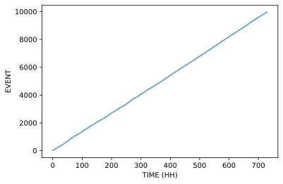
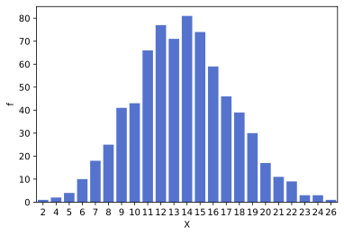
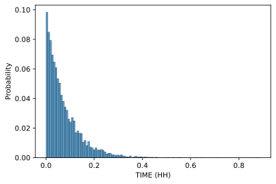

## 1. Defining the terms

Let $X$ be a discrete random variable that models the number of emails received by the company per hours, where $x=0, 1, 2, \ldots$.

Let $T$ be a continuous random variable that represents the time (in hours) between successive emailsreceived by the company, where $t > 0$.

## 2. Describing the data

**Table 1** and **Table 2** shows various properties of the number of emails received per hour and the waiting time between successive emails, respectively.

|      | $n$  | $\overline x$ | $\sigma$ | Min  | $q_L$ | $q_m$ | $q_U$ | Max  | IQR  |
| ---- | ---- | ------------- | -------- | ---- | ----- | ----- | ----- | ---- | ---- |
| $X$  | 731  | 13.633379     | 3.736115 | 2    | 11    | 14    | 16    | 26   | 5    |

**Table 1**. Properties of $X$.

|      | $n$  | $\overline x$ | $\sigma$ | Min      | $q_L$    | $q_m$    | $q_U$    | Max      | IQR      |
| ---- | ---- | ------------- | -------- | -------- | -------- | -------- | -------- | -------- | -------- |
| $T$  | 9965 | 0.073262      | 0.072297 | 0.000278 | 0.021667 | 0.051389 | 0.102778 | 0.888333 | 0.081111 |

**Table 2**. Properties of $T$, in unit decimal hours (apart from $n$).

## 3. Does the data fit the Poisson process

Data can be modelled by the **Poisson process**[^1] if it meets the following criteria:

- Events occur singly;
- The rate of occurrence of events remains constant;
- The incidence of future events is independent of the past.

Let us assume that the data meets the first criteria.
In this section we first look at if the rate of occurence remained constant over time.
This will show the scenario meets the second and third criteria.
We then check if a bar plot of the number of emails received in an hours matches that of a plot of the p.d.f. of a Poisson distribution.
Finally in this section we confirm that the distribution of the waiting times betwee successive emails is distributed exponentially.

### 3.1 Rate of occurrence remains constant over time

The second and third criteria can be checked by a single graph: *Is the average rate of emails received constant over the time period*?[^2] [^3]

**Figure 1**. Scatterplot of the rate of emails over time

We can see that the points lie approximately along a straight line, indicating that the rate of events remained constant over time.
This suggests that the Poisson process is indeed a suitable model for the scenario.

### 3.2 Number of emails per hours

Another property that we must confirm is that the p.d.f. of $X$ approxmates the p.d.f. of a Poisson distribution.[^1] [^2]

We can confirm this by comparing the frequency of $x_{i} \in X$ with that of the Poisson probability mass function of $\text{Poisson}(\lambda_{X})$, where $\lambda_{X}$ is the mean of the frequency of each distinct number of emails per hour.

The data was aggregated, producing a new view that showed the number of emails received per hour per day. From this, we then calculated $f_{X}$.[^4]

**Figure 2**. Histogram of number of emails per hours.

The plot in **Figure 2** is unimodal and is approximately symmetrical.
This indicates that the distribution could be modelled by a **Poisson distribution**.

Another check we can perform is checking if the $\overline X \simeq\sigma^{2}_{X}$, whcih is a property of a Poisson distribution.[^6]
**Table 1** shows $\overline X \simeq 13.6$, and $\sigma^{2}_{X} \simeq 13.96$. These two figures are close enough that we can say they are approximately equal, so we can conclude that the distribution of $X$ is approximately Poisson.

### 3.3 Waiting times between emails

The final property of the Poisson process that we must confirm is that the **waiting times between emails**, $T$, is approximately an exponential distribution.[^1] [^2] [^5]

**Figure 3**. Waiting time between successive emails.

The histogram is highly right-skewed with a high density of low values, as is expected by an exponential distribution.

This can be further supported by checked if the mean waiting time is approximately equal to the standard deviation.[^6]
Here, $\overline t \simeq 0.073$ with standard deviation $\sigma_{T} \simeq 0.072$.
These two figures are close enough that we can say they are approximately equal, so we can conclude that the distribution of $T$ is indeed approximately exponential.

## 4. Estimating the rate of emails of hours $\widehat \lambda$

### 4.1 Number of emails per hour

We confirmed it is possible the number of emails per hours could be modelled by the **Poisson distribution**, with parameter $\lambda_{X}$ being the expected number of emails per hour.

The maximum likelihood estimator of the Poisson distribution is given by $\widehat \lambda_{X} = \overline X$.[^6]
We calculated $\overline X \simeq 13.6$, so we propose that the number of emails per hour, $X$, can be modelled by a Poisson distribution, $X \sim \text{Poisson}(\widehat \lambda_{X})$, where $\widehat \lambda_{X} = \overline X \simeq 13.6$.

### 4.2 Waiting time between emails

We confirmed it is possible the waiting time between emails in unit hours could be modelled by the **exponential distribution**, with parameter $\lambda_{T}$.

The maximum likelihood estimator of the exponential distribution is given by $\widehat \lambda_{T} = 1 / \overline T$, where $\overline T$ is the average waiting time between emails in unit hours.[^6]
We calculated $\overline T \simeq 0.073$, so we propose that the waiting time between emails in unit hours, $T$, can be modelled by an exponential distribution distribution, $T \sim M(\widehat \lambda_{T})$, where $\widehat \lambda_{T} = 1/ \overline T \simeq 13.6$.

### 5. Confidence interval

We can produce a more useful estimate by calculating the 95% confidence interval of $\widehat \lambda$.
An approximate large sample $100(1 − \alpha)\%$ confidence interval for the Poisson parameter $\lambda$ is

$$
(\widehat \lambda^{-}, \widehat \lambda^{+}) = \bigg(\overline x - z \sqrt{\frac{\overline x}{n}}, \overline x + z \sqrt{\frac{\overline x}{n}}\bigg)
$$

where $\overline x$ is the **sample mean**, and $z$ is the $(1 − (\alpha/2))-$quantile of the standard normal distribution.[^7]

We know that $\overline x \simeq 13.6$ and $n=731$ (the number of hours in the sample), so[^8]

$$
\begin{aligned}
   \widehat \lambda^{-} &\simeq 13.6 - 1.96 \sqrt{\frac{13.6}{731}} = 13.3657 \ldots; \\
   \widehat \lambda^{+} &\simeq 13.6 + 1.96 \sqrt{\frac{13.6}{731}} = 13.9010 \ldots. \\
\end{aligned}
$$

Therefore, the 95% confidence interval for this data is approximately $(13.4, 13.9)$.

## 6. Conclusion

In this report, we took a large dataset containing approximately 10,000 observations of the date and time of the receipt of an email by a company.
The company was interested in modelling the number of emails they received per hour, and the waiting time between successive emails.

It was confirmed that the sample could be modelled by a **Poisson process**. This confirmation was used to calculate the maximum likelihood estimators of the Poisson and exponential parameters to ascertain $\widehat \lambda$.
We also calculated the 95% confidence interval for estimate.

[^1]: M248 HB pp.10.
[^2]: M248 Computer book A10, specifically subsection 1.
[^3]: See [3. Rate of emails remains constant](https://nbviewer.jupyter.org/github/ljk233/AutomatingM248/blob/master/projects/poisson_process/notebooks/2_poisson_process.ipynb#3.-Rate-of-emails-remains-constant) for how the plot was constructed (Jupyter).
[^4]: See [2. Number of emails per hour](https://nbviewer.jupyter.org/github/ljk233/AutomatingM248/blob/master/projects/poisson_process/notebooks/2a_poisson_process.ipynb#2.-Number-of-emails-per-hour) for how the plot was constructed (Jupyter).
[^5]: See [4. Waiting time between emails](https://nbviewer.jupyter.org/github/ljk233/AutomatingM248/blob/master/projects/poisson_process/notebooks/2_poisson_process.ipynb#4.-Waiting-time-between-emails) for how the plot was constructed (Jupyter).
[^6]: M248 HB pp.26-27.
[^7]: M248 HB pp.15.
[^8]: See [6. Confidence interval for $\lambda$](https://nbviewer.jupyter.org/github/ljk233/AutomatingM248/blob/master/projects/poisson_process/notebooks/2_poisson_process.ipynb#6.-Confidence-interval-for-$\lambda$) for these calculations (Jupyter).
